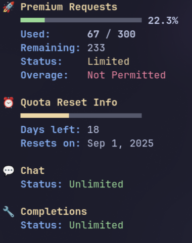

# Copilot Stats

<p align="center">
  
</p>

A simple Go CLI to display your GitHub Copilot usage statistics, including premium interactions, chat, and completions quotas, with styled terminal output.

## Setup
1. Clone the repository and build the binary:
   ```bash
   git clone https://github.com/sahaj-b/copilot-stats.git
   cd copilot-stats
   go build -o copilot-stats
   ```
2. (Optional) Install to your PATH for easy use:
   - Linux/macOS:
     ```bash
     install -m 0755 ./copilot-stats ~/.local/bin/copilot-stats
     # ensure ~/.local/bin is on PATH
     echo 'export PATH="$HOME/.local/bin:$PATH"' >> ~/.bashrc
     source ~/.bashrc
     ```
   - Or system-wide (requires sudo):
     ```bash
     sudo install -m 0755 ./copilot-stats /usr/local/bin/copilot-stats
     ```
3. Ensure you have a valid Copilot OAuth token. The tool will look for it in:
   - The `GITHUB_TOKEN` environment variable (if running in Codespaces)
   - `~/.config/github-copilot/hosts.json` or `~/.config/github-copilot/apps.json`

## Usage
Run the CLI:
```sh
copilot-stats   # if installed to PATH
# or
./copilot-stats
```

> [!NOTE]
> Disable colors by setting the NO_COLOR environment variable:
> `NO_COLOR=1 copilot-stats`
